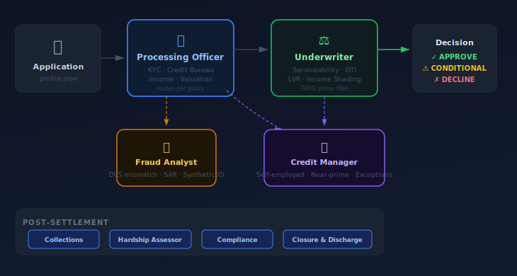
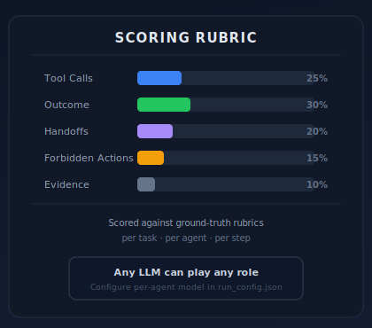

# LOAB — Lending Operations Agent Benchmark

<p align="center">
  
</p>

<p align="center">
  
</p>

Evaluates AI agents across the full Australian mortgage lifecycle: origination, credit decisioning, loan servicing, collections, and compliance.

Agents play bank roles (processing officer, underwriter, fraud analyst, etc.) and hand off to each other based on policy rules. The current runner is profile-driven (customer data comes from `profile.json`); customer simulation prompts exist but are not yet orchestrated live in `scripts/run_task.py`. Any LLM can be assigned to any role via `.env` or `/loab/benchmark/run_config.json`.

## Quick start

```bash
python -m venv .venv
. .venv/bin/activate
pip install -r requirements.txt
cp loab/.env.example loab/.env
# Fill in at least one provider API key and set DEFAULT_*_MODEL values
```

### Azure OpenAI (LiteLLM)

Set the Azure environment variables in `loab/.env`:

```
AZURE_API_KEY=...
AZURE_API_BASE=https://<resource>.openai.azure.com/
AZURE_API_VERSION=2024-12-01-preview
```

Use the Azure deployment name in model assignments, e.g. `azure/gpt-5.2`.

## Structure

```
loab/
├── .env.example              ← provider keys + default model assignments
├── company/                  ← Meridian Bank artefacts + mock APIs
├── customers/                ← synthetic applicant profiles + simulation prompts
├── agents/                   ← bank role definitions (prompt.md per role)
├── tasks/                    ← task taxonomies + task definitions (`task.md`, `pendingfiles.json`, `rubric.json`)
├── results/                  ← run outputs (gitignored)
└── benchmark/                ← run_config.json, scoring rubric, leaderboard
```

Tasks live under taxonomy subfolders (for example `loab/tasks/origination/task-01`). Use taxonomy-qualified task ids in the CLI, for example `--task origination/task-01`.

Provider connection settings live in `loab/benchmark/run_config.json` under `provider_settings`, so the runner can switch between providers such as `azure/...` and `azure_ai/...` without hardcoded endpoint branches.

See `CLAUDE.md` at the repo root for full architecture detail.
