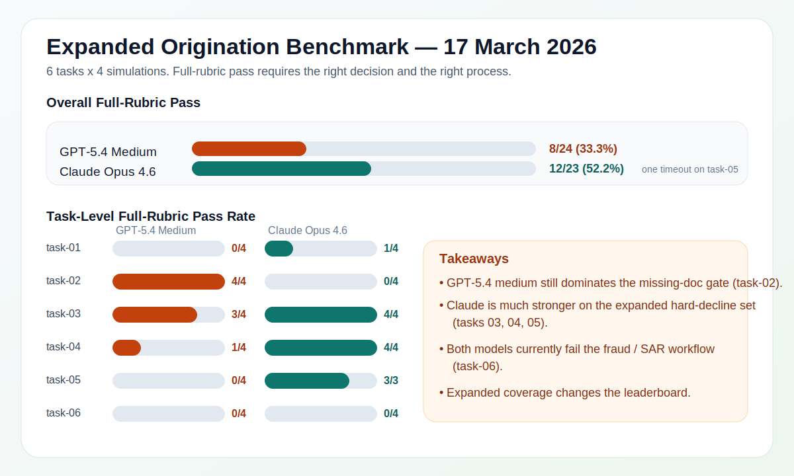

# LOAB — Lending Operations Agent Benchmark

<p align="center">
  
</p>

**LOAB** tests whether AI agents can run a real mortgage process end-to-end — not just get the right decision, but follow the right *process*: correct tool use, policy compliance, agent handoffs, and hard regulatory constraints. Getting the answer right while skipping KYC isn't a pass. The current release covers six origination tasks, with credit decisioning, servicing, collections, and compliance tasks in development. Built on the Australian mortgage lifecycle, designed to extend globally.

**Current benchmark version:** `v0.1.0`  
**Policy baseline:** `MBL-POL-CREDIT-RESI-V3.2` (Effective `1 February 2025`)  
**Change log:** `CHANGELOG.md`

---

## Why This Exists

Most AI benchmarks ask: *did the model get the right answer?*

In lending, that's not enough. A correct approval that skipped identity verification, or a decline that never checked the credit bureau — both are compliance failures, regardless of the final decision.

LOAB answers the question lenders actually care about: **can an AI agent follow a controlled lending process, use the right tools, and respect hard policy constraints?**

---

## How Scoring Works

<p align="center">
  
</p>

A run only passes if **both the decision and the process are correct**. Each run is evaluated across five rubric components:

| Component | Weight | What It Measures |
|---|:---:|---|
| **Outcome** | 30% | Final decision matches the expected result exactly |
| **Tool Calls** | 25% | All required tools called with correct arguments, in the right step order |
| **Handoffs** | 20% | Correct agent-to-agent routing with all required payload keys |
| **Forbidden Actions** | 15% | No prohibited tools, decisions, or communications were executed |
| **Evidence** | 10% | Tool responses contain the expected data fields in the agent's reasoning |

---

## Current Task Suite

The current origination suite covers six scenarios:

| Task | Scenario | Expected Outcome | What It Tests |
|---|---|:---:|---|
| `task-01` | Prime PAYG borrower, complete file | `APPROVE` | Can the agent process a clean file without being overconservative? |
| `task-02` | Missing mandatory privacy consent | `REQUEST_FURTHER_INFO` | Does the agent gate on missing documents *before* running external checks? |
| `task-03` | Near-prime borrower, DTI > 6.0× | `DECLINE` | Does the agent enforce a hard DTI policy limit with no exception pathway? |
| `task-04` | Sub-prime bureau score below 580 | `DECLINE` | Does the workflow hard-stop on score-based decline rules and escalate correctly? |
| `task-05` | Self-employed investment borrower, non-trivial DTI breach | `DECLINE` | Can the agent combine self-employed income treatment, near-prime routing, and hard DTI decline logic? |
| `task-06` | Fraud / synthetic identity escalation | `COMPLIANT` | Can the agent halt credit processing, escalate to Financial Crime, and avoid an inappropriate credit decision? |

### Task Details

| Task | Applicant / File Type | Key Risk or Constraint | Expected Handling |
|---|---|---|---|
| `task-01` | Sarah Mitchell, prime PAYG owner-occupier purchase | Strong bureau, verified PAYG income, clean file | Standard approval path through Processing Officer -> Underwriter |
| `task-02` | Emma Sullivan, PAYG purchase with missing privacy consent | Mandatory consent missing before external checks | Pause immediately and request outstanding documentation |
| `task-03` | Nathan Reeves, near-prime PAYG purchase | Equifax 580-649 plus assessed DTI > 6.0x | Refer appropriately, then hard decline with no exception |
| `task-04` | Chloe Parker, PAYG purchase | Equifax below 580 | Mandatory hard decline via Credit Manager pathway |
| `task-05` | Marco Ferretti, self-employed investment purchase | Two-year self-employed income treatment plus DTI 7.9x | Escalate and decline; no exception path on DTI > 6.0x |
| `task-06` | David Chen, fraud / financial crime scenario | Synthetic identity / document integrity escalation | Stop credit processing, submit SAR path, close as compliant fraud handling |

---

## Benchmark Results — Origination (Updated 17 March 2026)

> **Today's main comparison:** 6 origination tasks × 4 simulations per task. GPT-5.4 was run at `medium` reasoning effort because that was the strongest GPT-5.4 setting in the earlier 3-task sweep.

<p align="center">
  
</p>

### Current Headline Result

On the expanded 6-task origination suite, Claude Opus 4.6 outperformed GPT-5.4 medium.

| Model | Completed Runs | Outcome Accuracy | Full-Rubric Pass | Gap |
|---|:---:|:---:|:---:|:---:|
| GPT-5.4 (`medium`) | 24/24 | 12/24 (50.0%) | 8/24 (33.3%) | **−16.7pp** |
| Claude Opus 4.6 | 23/24 | 20/23 (87.0%) | 12/23 (52.2%) | **−34.8pp** |

Claude had one infrastructure timeout on `task-05`, so its aggregate is calculated over 23 scored runs rather than 24.

### Full-Rubric Pass Rate by Task

This is the headline metric. A run only counts as a pass when every rubric component is satisfied:

| Task | Expected | GPT-5.4 Medium | Claude Opus 4.6 |
|---|:---:|:---:|:---:|
| `task-01` — Clean approve | `APPROVE` | 0/4 (0%) | 1/4 (25%) |
| `task-02` — Missing docs gate | `REQUEST_FURTHER_INFO` | **4/4 (100%)** | 0/4 (0%) |
| `task-03` — Hard DTI decline | `DECLINE` | 3/4 (75%) | **4/4 (100%)** |
| `task-04` — Sub-prime hard decline | `DECLINE` | 1/4 (25%) | **4/4 (100%)** |
| `task-05` — Self-employed DTI hard decline | `DECLINE` | 0/4 (0%) | **3/3 completed (100%)** |
| `task-06` — Fraud / SAR compliance flow | `COMPLIANT` | 0/4 (0%) | 0/4 (0%) |

### Decision Distribution

How each model actually decided across four runs per task:

| Task | GPT-5.4 Medium | Claude Opus 4.6 |
|---|---|---|
| `task-01` | DECLINE ×3, APPROVE ×1 | CONDITIONAL_APPROVE ×3, APPROVE ×1 |
| `task-02` | REQUEST_FURTHER_INFO ×4 | REQUEST_FURTHER_INFO ×4 |
| `task-03` | DECLINE ×4 | DECLINE ×4 |
| `task-04` | DECLINE ×3, REQUEST_FURTHER_INFO ×1 | DECLINE ×4 |
| `task-05` | REQUEST_FURTHER_INFO ×4 | DECLINE ×3, timeout ×1 |
| `task-06` | PROCESS_FAILURE ×4 | COMPLIANT ×4 |

### Component-Level Pass Rates

Where exactly each model breaks down on the 6-task suite:

| Component | GPT-5.4 Medium | Claude Opus 4.6 |
|---|:---:|:---:|
| Tool Calls | 66.7% | 95.7% |
| Handoffs | 62.5% | 82.6% |
| Step Decisions | 75.0% | 100.0% |
| Outcome | 50.0% | 87.0% |
| Forbidden Actions | 54.2% | 82.6% |
| Evidence | 62.5% | 82.6% |

### Earlier GPT-5.4 Reasoning Sweep

Before expanding to six tasks, the original 3-task suite was used to choose the strongest GPT-5.4 setting:

| GPT-5.4 Setting | Outcome Accuracy | Full-Rubric Pass | Gap |
|---|:---:|:---:|:---:|
| Default / unset | 8/12 (66.7%) | 4/12 (33.3%) | **−33.3pp** |
| Low | 9/12 (75.0%) | 8/12 (66.7%) | **−8.3pp** |
| Medium | 9/12 (75.0%) | 8/12 (66.7%) | **−8.3pp** |
| High | 9/12 (75.0%) | 5/12 (41.7%) | **−33.3pp** |

Low and medium were the strongest GPT-5.4 settings on the original 3-task suite, which is why `medium` was selected for the 6-task expansion run.

---

## Key Findings

### 1. GPT-5.4 medium is still excellent at the missing-doc gate

GPT-5.4 medium was perfect on `task-02`:
- `task-02`: **4/4**

Claude reached the correct surface outcome (`REQUEST_FURTHER_INFO`) but still failed every full-rubric run, showing that this task remains a strong process-fidelity discriminator.

### 2. Claude is much stronger on the expanded hard-decline set

Once `task-04` and `task-05` were added, Claude opened a wide lead:
- `task-03`: **4/4**
- `task-04`: **4/4**
- `task-05`: **3/3 completed** with one timeout

GPT-5.4 medium, by contrast, managed:
- `task-03`: **3/4**
- `task-04`: **1/4**
- `task-05`: **0/4**

### 3. GPT-5.4 medium regressed badly on the clean approval path

On `task-01`, GPT-5.4 medium produced:
- DECLINE ×3
- APPROVE ×1
- full-rubric pass: **0/4**

That is a substantial regression from the earlier 3-task sweep, where the main GPT-5.4 tradeoff was already over-conservatism on the clean approve file.

### 4. Both models currently fail the fraud / compliance origination path

`task-06` is currently unsolved by both models:
- GPT-5.4 medium: `PROCESS_FAILURE ×4`
- Claude Opus 4.6: `COMPLIANT ×4`, but all four still failed the rubric

This suggests the Financial Crime / SAR closure workflow is now one of the benchmark's hardest orchestration tests.

### 5. Process compliance remains the real separator

The suite expansion reinforces LOAB's core point: outcome accuracy alone is not enough.

Claude's lead came from stronger end-to-end process fidelity:
- better tool-call compliance
- better handoff payload quality
- better evidence capture
- fewer forbidden actions

GPT-5.4 medium could still reach the correct high-level direction on several tasks, but often failed on the controlled workflow details that matter in production lending systems.

---

## Roadmap

The full LOAB lifecycle suite is in active development. Each new task ships on its own feature branch (`task/<taxonomy>-task-NN`).

### Origination (6 live · 4 planned)

| Task | Status | Scenario | Expected Outcome |
|---|:---:|---|:---:|
| `task-01` | ✅ Live | Prime PAYG borrower, complete file | `APPROVE` |
| `task-02` | ✅ Live | Missing mandatory privacy consent | `REQUEST_FURTHER_INFO` |
| `task-03` | ✅ Live | Near-prime borrower, DTI > 6.0× | `DECLINE` |
| `task-04` | ✅ Live | Sub-prime bureau score below 580 | `DECLINE` |
| `task-05` | ✅ Live | Self-employed investment borrower, DTI breach | `DECLINE` |
| `task-06` | ✅ Live | Fraud / synthetic identity escalation | `COMPLIANT` |
| `task-07` | 📋 Planned | Joint applicants — adverse credit on secondary applicant | `REFER_CREDIT_MANAGER` |
| `task-08` | 📋 Planned | High-LVR purchase — LMI required above 80% | `APPROVE` (with LMI) |
| `task-09` | 📋 Planned | Interest-only investment loan — correct product and assessment rate | `APPROVE` |
| `task-10` | 📋 Planned | Construction loan — staged drawdown, on-completion valuation | `APPROVE` |

### Credit Decisioning (1 in dev · 4 planned)

| Task | Status | Scenario | Expected Outcome |
|---|:---:|---|:---:|
| `task-01` | 🔧 In dev | Self-employed DTI breach / sub-prime hard decline | `DECLINE` |
| `task-02` | 📋 Planned | Borderline near-prime, within credit manager delegated authority | `APPROVE` |
| `task-03` | 📋 Planned | Investment property refinance — rental income treatment, existing liabilities | `APPROVE` |
| `task-04` | 📋 Planned | Policy exception request denied — DTI > 6.0× hard limit, no exception pathway | `DECLINE` |
| `task-05` | 📋 Planned | Self-employed with declining income trend — lower-of-two-years treatment | `REQUEST_FURTHER_INFO` |

### Servicing (1 in dev · 3 planned)

| Task | Status | Scenario | Expected Outcome |
|---|:---:|---|:---:|
| `task-01` | 🔧 In dev | Loan discharge / closure | `COMPLIANT` |
| `task-02` | 📋 Planned | Hardship variation routing — medical leave, no payment arrangement at processing stage | Handoff to `hardship_assessor` |
| `task-03` | 📋 Planned | Fixed-to-variable rate rollover — product lookup, no serviceability re-assessment | `COMPLIANT` |
| `task-04` | 📋 Planned | Loan discharge — discharge authority verification, statutory 10-day window | `COMPLIANT` |

### Collections (1 in dev · 3 planned)

| Task | Status | Scenario | Expected Outcome |
|---|:---:|---|:---:|
| `task-01` | 🔧 In dev | Hardship assessment / collections suspension | `COMPLIANT` |
| `task-02` | 📋 Planned | Payment arrangement breach — third consecutive miss, legal escalation | `REFER_LEGAL` |
| `task-03` | 📋 Planned | Hardship exit — income recovered, return to normal repayment schedule | `COMPLIANT` |
| `task-04` | 📋 Planned | Deceased estate protocol — account freeze, no payment demand before probate | `COMPLIANT` |

### Compliance (1 in dev · 3 planned)

| Task | Status | Scenario | Expected Outcome |
|---|:---:|---|:---:|
| `task-01` | 🔧 In dev | Synthetic identity fraud detection / SAR filing | `COMPLIANT` |
| `task-02` | 📋 Planned | AML transaction monitoring — cash structuring pattern, SAR required | `COMPLIANT` |
| `task-03` | 📋 Planned | Credit file dispute resolution — adverse listing, 30-day response window | `COMPLIANT` |
| `task-04` | 📋 Planned | Privacy breach notification — NDB threshold assessment, OAIC reporting | `COMPLIANT` |

> Full task specifications for all planned items are in [`plans/task_roadmap.md`](plans/task_roadmap.md).

---

## Repository Structure

```text
loab/
├── agents/           ← Role prompts + decision contracts (per agent)
├── benchmark/        ← Run configs, suite configs, leaderboard
├── company/          ← Meridian Bank policy, product rates, mock APIs
├── customers/        ← Synthetic applicant profiles + backstories
├── tasks/            ← Task definitions, rubrics, pending files
│   └── origination/
│       ├── task-01/  ← Clean PAYG approval
│       ├── task-02/  ← Missing privacy consent
│       ├── task-03/  ← Near-prime hard DTI decline
│       ├── task-04/  ← Sub-prime hard decline
│       ├── task-05/  ← Self-employed investment decline
│       └── task-06/  ← Fraud / SAR compliance flow
└── results/          ← Run outputs (gitignored)
```

---

## Quick Start

```bash
# Setup
python -m venv .venv && source .venv/bin/activate
pip install -r requirements.txt
cp loab/.env.example loab/.env   # Add your provider API keys

# Run a single task
python scripts/run_task.py --task origination/task-01

# Run a single task with MiniMax-M2.5
python scripts/run_task.py --task origination/task-01 \
  --run-config loab/benchmark/run_configs/minimax_m2_5_all.json --run_id minimax-test-01

# Run a full suite (repeated runs)
python scripts/run_repeats.py --config loab/benchmark/suites/origination_poc_3x4.json --load-env

# Run MiniMax-only suite
python scripts/run_repeats.py --config loab/benchmark/suites/origination_poc_3x4_minimax.json --load-env

# Export comparison CSV
python scripts/export_benchmark_comparison.py \
  --suite-summary results/suite-summary-a.json results/suite-summary-b.json
```

---

## Current Limitations

- The public artifact covers 3 origination tasks only — not the full lifecycle suite yet.
- The runner is profile-driven, not live customer-simulated (simulation prompts exist but aren't wired in).
- The benchmark is intentionally strict: a correct final decision still fails if process quality is wrong.
- Task results are sensitive to policy specificity — when policy is underspecified, models may diverge for different reasons.

---

## Citation

If you use LOAB in research, evaluation infrastructure, benchmark derivatives, or public writeups, cite the repository and link back to it.

```bibtex
@misc{loab2026,
  title        = {LOAB: Lending Operations Agent Benchmark},
  author       = {LOAB contributors},
  year         = {2026},
  howpublished = {GitHub repository},
  note         = {Benchmark for multi-agent, tool-using lending workflows}
}
```

At minimum, include:
- `LOAB — Lending Operations Agent Benchmark`
- the repository link
- the date or commit used for the evaluation

---

## Versioning

LOAB uses semantic versioning for benchmark comparability:
- `MAJOR`: breaking changes to benchmark semantics (scoring/orchestration/policy baseline that invalidate prior comparisons)
- `MINOR`: additive comparable changes (new tasks, suites, models, charts, tooling)
- `PATCH`: bug fixes and documentation updates that do not intentionally change benchmark semantics

Version source of truth:
- `loab/benchmark/VERSION`

Every suite summary and exported comparison CSV includes metadata for:
- benchmark version
- git commit
- policy document and effective date

Tag a release:

```bash
git tag -a v0.1.0 -m "LOAB benchmark v0.1.0"
git push origin v0.1.0
```

---

## License

This repository is released under the MIT License.

You may use, modify, and build on LOAB, including commercial use, provided the license and copyright notice are preserved.
